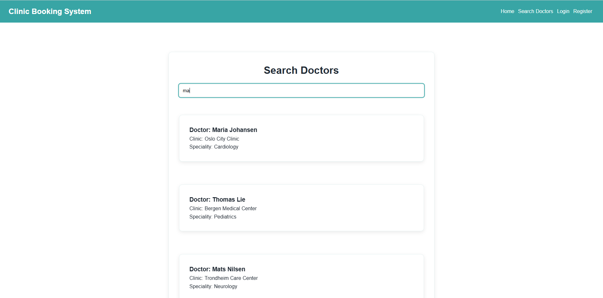
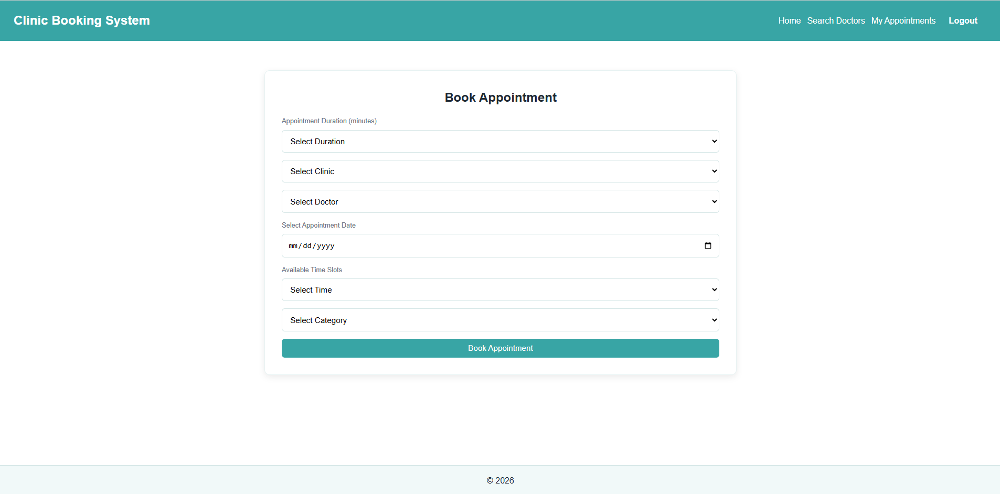
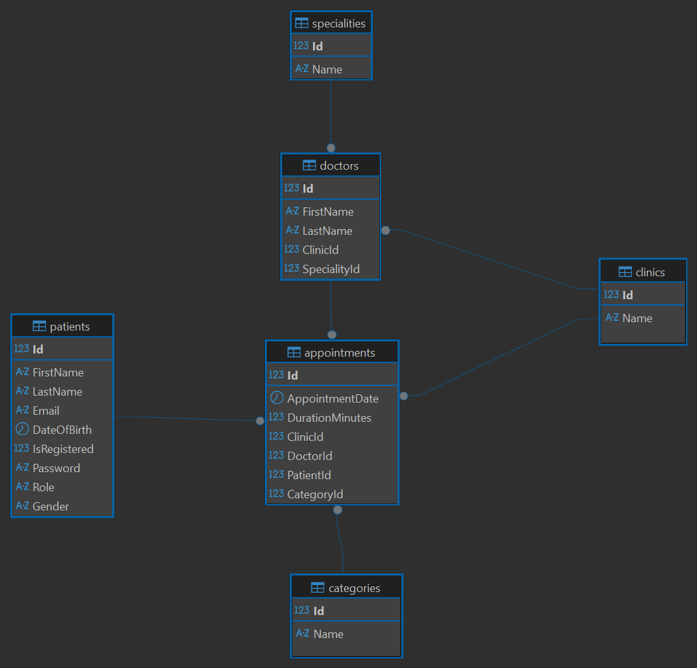

# Clinic Appointment Booking System

A full-stack clinic appointment booking platform built with **ASP.NET Core Web API (.NET 9)** and **React + TypeScript**, deployed on **Microsoft Azure** with automated **CI/CD using GitHub Actions**.

The project demonstrates a modern cloud-hosted application architecture including REST API design, authentication, database integration, and frontend-backend communication.

The system allows patients to search for doctors, book appointments, manage bookings, and provides administrative functionality for managing clinics, doctors, and medical categories.

---

# Project Background

This project was originally developed as part of the **Noroff Backend Development program**.

The original brief required building a **full-stack clinic appointment booking system** with:

- a **MySQL database** designed using **Entity Framework Core Code-First**
- an **ASP.NET Core REST API**
- a **React + TypeScript frontend**
- **Swagger API documentation**
- support for both **guest users** and **registered patients**
- **authentication** for registered users
- CRUD functionality, validation, and appointment conflict prevention
- a doctor search feature returning the doctor’s **name, clinic, and speciality**

The exam project tested database design, API development, frontend functionality, documentation, and full-stack problem-solving. This public repository represents the **continued development of that original school project**, with additional work focused on deployment, architecture, documentation, testing, and overall portfolio quality.

The implementation reflects the scope of the original exam requirements.
In a real-world healthcare platform the system would typically include additional capabilities such as advanced patient data management, notification systems, and extended administrative roles.
As development continues, the platform can be expanded with additional healthcare roles (e.g., doctors, nurses, reception staff), appointment reminders, calendar integrations, and enhanced search or reporting capabilities.

---

# Live Application

Frontend
https://app.ranjitnair.dev

Backend API
https://api.ranjitnair.dev

Swagger API Documentation
https://api.ranjitnair.dev/doc

Health Check
https://api.ranjitnair.dev/health

---

# Quick Start (Local Development)

Clone the repository:

```bash
git clone https://github.com/ranjitwn/clinic-appointment-system.git
cd clinic-appointment-system
```

## 1. Prepare Local Database

Ensure **MySQL Server** is installed (for example via MySQL Workbench).

Create a local database:

```sql
CREATE DATABASE clinicappointmentdb;
```

Update the backend connection string for your local environment.

Example in `appsettings.Development.json`:

```json
{
  "ConnectionStrings": {
    "DefaultConnection": "server=localhost;port=3306;database=clinicappointmentdb;user=root;password=yourpassword"
  }
}
```

---

## 2. Start Backend API

```bash
cd Backend/ClinicAppointment.API
dotnet restore
dotnet ef database update
dotnet run
```

Backend runs on:

```
http://localhost:5108
```

Swagger documentation:

```
http://localhost:5108/doc
```

---

## 3. Start Frontend

```bash
cd Frontend
npm install
npm run dev
```

Frontend runs on:

```
http://localhost:5173
```

⚠️ Ensure the backend API is running before starting the frontend.

---

# Demo Access

The administrator account is automatically seeded when the application starts.

To explore the administrative functionality of the system you can log in using the demo administrator account:

**Admin Email:** admin@clinic.com  
**Admin Password:** Admin123!

Admin credentials are provided for demonstration purposes only.

---

---

# Application Screenshots

### Doctor Search



### Appointment Booking


### Patient Dashboard



### Admin Management


---

# System Architecture

The system follows a layered architecture separating the client interface, backend application logic, and persistent data storage.

**Client Layer**
React + TypeScript web application running in the browser.

**Application Layer**
ASP.NET Core Web API handling business logic, authentication, and data validation.

**Data Layer**
Azure MySQL database accessed through Entity Framework Core using Code-First migrations.

Communication between frontend and backend is performed through **HTTPS REST APIs with JSON responses**.


---

# Database Design

The relational database schema was designed using Entity Framework Core Code-First migrations and is hosted on Azure Database for MySQL.

The system revolves around the **Appointments** entity which connects patients, doctors, clinics, and appointment categories. Supporting tables such as **Specialities** and **Clinics** provide structured medical data used by the application.

Key relationships include:

• A **Doctor** belongs to a **Clinic** and has a **Speciality**  
• A **Patient** can create multiple **Appointments**  
• Each **Appointment** is linked to a **Doctor**, **Clinic**, and **Category**  
• **Categories** define the type of appointment (Check-up, Consultation, etc.)

The following ER diagram shows the full database structure and relationships.



---

# Project Structure

```
Root
│
├── Backend
│   └── ClinicAppointment.API
│       └── README.md
│
├── Frontend
│   └── README.md
│
└── mar25ft-ep2-ranjitwn.sln
```

Additional documentation:

- Backend → Backend API documentation
- Frontend → Frontend application documentation

---

# Technologies Used

## Backend

- ASP.NET Core (.NET 9)
- Entity Framework Core (Code-First)
- MySQL Database
- JWT Authentication
- Role-Based Authorization
- Swagger / OpenAPI
- Global Exception Middleware

## Frontend

- React 18
- TypeScript
- Vite
- React Router
- Fetch API
- ESLint with strict TypeScript configuration

## Cloud & DevOps

- Microsoft Azure App Service
- Azure Static Web Apps
- Azure Database for MySQL
- GitHub Actions CI/CD
- Custom domain configuration

---

# Key Features

- Patient registration and authentication using JWT
- Guest appointment booking
- Doctor search and filtering
- Appointment scheduling with availability validation
- Patient appointment management
- Admin management of clinics, doctors, categories, and specialities
- Secure REST API with role-based authorization
- Global error handling middleware with structured logging
- Cloud deployment on Microsoft Azure
- Automated CI/CD pipeline with GitHub Actions

---

# Running the Project Locally

## Start Backend

```bash
cd Backend/ClinicAppointment.API
dotnet restore
dotnet ef database update
dotnet run
```

Backend runs on:

```
http://localhost:5108
```

Swagger documentation:

```
http://localhost:5108/doc
```

---

## Start Frontend

```bash
cd Frontend
npm install
npm run dev
```

Frontend runs on:

```
http://localhost:5173
```

---

# Deployment Architecture

The application is deployed on Microsoft Azure using a cloud architecture consisting of:

**Frontend**
Azure Static Web Apps hosting the React application.

**Backend**
Azure App Service hosting the ASP.NET Core Web API.

**Database**
Azure Database for MySQL.

**DNS & Domain**
Custom domain configuration using Namecheap DNS.


---

# CI/CD Pipeline

Continuous deployment is implemented using GitHub Actions.

The pipeline performs:

- Build ASP.NET Core backend
- Deploy backend to Azure App Service
- Build React frontend
- Deploy frontend to Azure Static Web Apps

Deployment is triggered automatically when changes are pushed to the repository.

---

# Automated Testing

The backend includes automated unit tests to validate core business logic in the service layer.

Testing is implemented using:

- **xUnit testing framework**
- **Entity Framework Core InMemory provider**
- Isolated service-level tests without external dependencies

This allows validation of scheduling rules and API logic without requiring a real database connection.

Example tested components:

```
AppointmentService
AuthService
```

Tests are executed automatically in the **CI/CD pipeline** to ensure application stability before deployment.

Run tests locally:

```bash
dotnet test
```

---

# Configuration

Sensitive configuration values such as database connection strings, JWT keys, and admin credentials are stored using **environment variables in Azure** rather than inside the repository.

This ensures secure configuration management for production deployments.

---

# Summary

This project demonstrates:

- Full-stack web application development
- REST API design with ASP.NET Core
- JWT authentication and role-based authorization
- Entity Framework Core with MySQL
- React + TypeScript frontend development
- Cloud deployment on Microsoft Azure
- CI/CD automation with GitHub Actions
- Automated backend unit testing
- Secure configuration using environment variables
