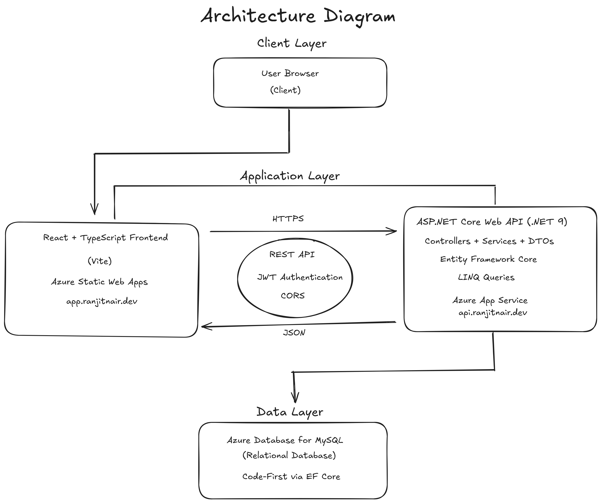
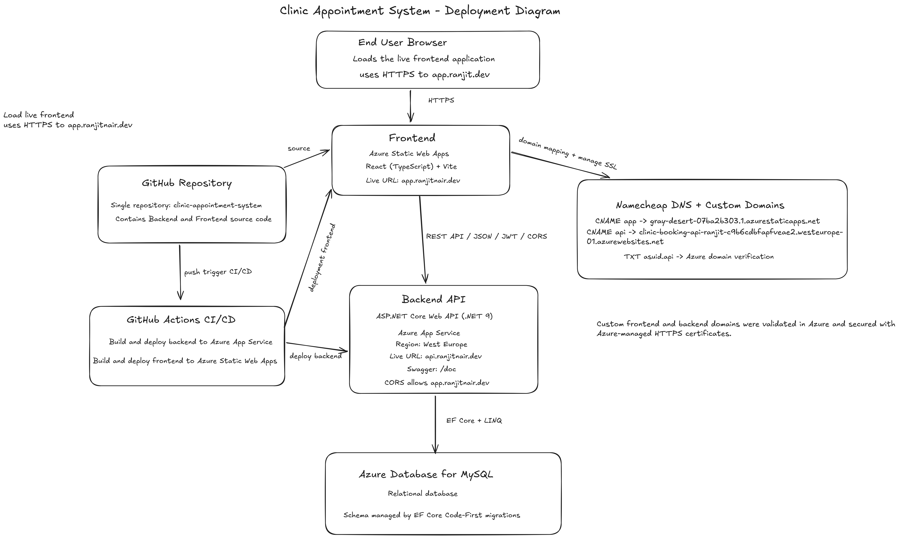

# Clinic Appointment Booking System

A full-stack clinic appointment booking platform built with ASP.NET Core Web API and React, deployed on Microsoft Azure with CI/CD using GitHub Actions.

The project was originally developed as part of a backend development course and later extended, deployed to the cloud, and maintained as a production-style portfolio project.

The solution consists of two main applications:

* **Backend:** ASP.NET Core (.NET 9) REST API using Entity Framework Core and MySQL
* **Frontend:** React + TypeScript + Vite application

The system supports clinic appointment booking, patient authentication, guest booking, doctor search, appointment management, and admin configuration features.

# Live Application

The application is deployed to Microsoft Azure and accessible through custom domains.

Frontend: https://app.ranjitnair.dev  
Backend API: https://api.ranjitnair.dev  
Swagger API Documentation: https://api.ranjitnair.dev/doc


## Project Structure (Root)

```
Root/
│
├── Backend/
│   └── ExamProject2.API/
│       └── README.md
│
├── Frontend/
│   └── README.md
│
└── mar25ft-ep2-ranjitwn.sln
```

Detailed technical documentation is available in:

* `Backend/README.md` → Backend API documentation
* `Frontend/README.md` → Frontend application documentation

---

## Technologies Used

### Backend

* ASP.NET Core (.NET 9)
* Entity Framework Core (Code‑First)
* MySQL Database
* JWT Authentication
* Swagger API Documentation
* Global Exception Middleware
* Role‑based Authorization

### Frontend

* React 18
* TypeScript
* Vite
* React Router DOM
* Fetch API for backend communication
* ESLint (strict TypeScript configuration)
* @vitejs/plugin-react (Fast Refresh + JSX support)

---

## Running the Project (Quick Start)

### 1. Start Backend

From the root folder:

```
cd Backend/ExamProject2.API
dotnet restore
dotnet ef database update
dotnet run
```

Backend runs on:

```
http://localhost:5108
```

Swagger API documentation is accessible at:

```
http://localhost:5108/doc
```

---

### 2. Start Frontend

Open a new terminal:

```
cd Frontend
npm install
npm run dev
```

Frontend runs on:

```
http://localhost:5173
```

---

## ENDPOINTS

The backend exposes REST endpoints grouped by controller.  
Access varies depending on authentication and role.

---

### Authentication (Guest / Public)

- POST `/api/Auth/register` → Register patient account  
- POST `/api/Auth/login` → Login and receive JWT token  

---

### Appointments

#### Guest + Registered Patient

- POST `/api/Appointment` → Create appointment (guest or logged-in patient)  
- GET `/api/Appointment/available-slots` → Get available time slots  

#### Registered Patient Only (JWT Required)

- GET `/api/Appointment/my` → View own appointments  
- PUT `/api/Appointment/{id}` → Update own appointment  
- DELETE `/api/Appointment/{id}` → Cancel own appointment  

#### Admin Only

- GET `/api/Appointment/clinic/{clinicId}` → All appointments for clinic  
- GET `/api/Appointment/doctor/{doctorId}` → All appointments for doctor  

---

### Doctors

#### Public / Guest Access

- GET `/api/Doctor` → List doctors  
- GET `/api/Doctor/{id}` → Doctor details  
- GET `/api/Doctor/search` → Search doctors  
- GET `/api/Doctor/by-clinic/{clinicId}` → Filter by clinic  
- GET `/api/Doctor/by-speciality/{specialityId}` → Filter by speciality  

#### Admin Only

- POST `/api/Doctor` → Create doctor  
- PUT `/api/Doctor/{id}` → Update doctor  
- DELETE `/api/Doctor/{id}` → Delete doctor  

---

### Clinics

#### Public Access

- GET `/api/Clinic` → List clinics  
- GET `/api/Clinic/{id}` → Clinic details  

#### Admin Only

- POST `/api/Clinic` → Create clinic  
- PUT `/api/Clinic/{id}` → Update clinic  
- DELETE `/api/Clinic/{id}` → Delete clinic  

---

### Categories

#### Public Access

- GET `/api/Category` → List categories  
- GET `/api/Category/{id}` → Category details  

#### Admin Only

- POST `/api/Category` → Create category  
- PUT `/api/Category/{id}` → Update category  
- DELETE `/api/Category/{id}` → Delete category  

---

### Specialities

#### Public Access

- GET `/api/Speciality` → List specialities  
- GET `/api/Speciality/{id}` → Speciality details  

#### Admin Only

- POST `/api/Speciality` → Create speciality  
- PUT `/api/Speciality/{id}` → Update speciality  
- DELETE `/api/Speciality/{id}` → Delete speciality  

---

### Patients (Admin Only)

- GET `/api/Patient` → List patients  
- GET `/api/Patient/{id}` → Patient details  
- POST `/api/Patient` → Create patient  
- PUT `/api/Patient/{id}` → Update patient  
- DELETE `/api/Patient/{id}` → Delete patient  

---

For detailed endpoint documentation, request/response examples, and validation rules, refer to:

**Backend/README.md**
---

## Guest vs Registered Patient Flow

### Guest Patients

* Can book appointments without login
* Must provide personal details during booking
* Cannot manage appointments unless they later register

If a guest registers using the same email address:

* Their guest record is upgraded to a registered patient
* Previously created appointments become accessible

### Registered Patients

* Can register and login
* JWT authentication is used
* Can view, update, and cancel their appointments

---

## Admin Role Implementation

This project does not use a separate Admin entity.

Instead:

* Admin users are stored in the Patients table
* Role‑based authorization determines access:

```
Role = "Admin"
IsRegistered = true
```

Admin capabilities include:

* Managing clinics
* Managing doctors
* Managing categories and specialities
* Viewing appointment data

This design simplifies authentication while maintaining secure role‑based access control.

---

## Security Considerations

### Database & Admin Setup Note

The database is created using **Entity Framework Core Code-First migrations**, as required in the exam brief.

A default **Admin account is seeded automatically** to allow immediate testing without manual database setup.

Some configuration values (such as database connection, JWT key, and admin seed credentials) are stored in `appsettings.json` for development and exam demonstration purposes only.

In real production environments, these should be managed securely using environment variables or a secret manager.

### Development Configuration

The following configuration values are stored locally for development and exam purposes:

* Database connection string
* JWT secret key
* Admin seed credentials

### Production Recommendation

In real deployments these should be stored securely using:

* Environment variables
* Secret managers
* Secure configuration providers

Additional recommended practices:

* Always use HTTPS
* Avoid committing secrets to version control
* Apply proper authentication and authorization policies

---

## Patient Data Privacy Note

The exam brief references extended patient personal data fields.
This implementation intentionally stores only essential booking data:

* First name
* Last name
* Email
* Date of birth
* Gender

Sensitive identifiers such as:

* SSN
* Tax numbers
* Religion
* Driver’s license numbers
* Medical insurance membership numbers

were intentionally excluded due to privacy and security considerations.

This decision follows GDPR data-minimisation principles and information security best practices, 
ensuring that only necessary Personally Identifiable Information (PII) is stored while still meeting functional booking requirements.

---

## CORS Configuration

Backend CORS is configured to allow the frontend development server:

```
http://localhost:5173
```

Reference documentation:

Microsoft ASP.NET Core Security Documentation
[https://learn.microsoft.com/en-us/aspnet/core/security/cors](https://learn.microsoft.com/en-us/aspnet/core/security/cors)

---

## Additional Features Beyond Original Requirements

This project was originally developed as part of a backend development exam assignment.  
After completing the required functionality, additional improvements and features were implemented to extend the system and demonstrate real-world development practices.

These enhancements include:

* Role-based admin management
* Appointment slot validation rules
* Doctor filtering and search functionality
* Admin appointment overview endpoints
* Global exception middleware for consistent JSON responses
* Cloud deployment using Azure
* CI/CD deployment using GitHub Actions

This project is continuously being improved as a portfolio project. 
Future updates may include additional features, improvements to the user experience, and further CI/CD enhancements.

---

## System Architecture

The application follows a layered architecture separating the client, application logic, and data storage.

The architecture is composed of three main layers:

• **Client Layer** – User interacts with the system through a web browser that loads the React frontend.  
• **Application Layer** – The React frontend communicates with the ASP.NET Core Web API using HTTPS REST requests.  
• **Data Layer** – The backend API accesses the MySQL database using Entity Framework Core with Code-First migrations.

Authentication is handled using **JWT tokens**, and communication between frontend and backend uses **JSON over HTTPS**.

This architecture promotes clear separation of concerns between the frontend user interface, backend business logic, and persistent data storage.

### Architecture Diagram

The following diagram illustrates the overall system architecture and interaction between components.



---

# Deployment Architecture

This project is deployed using a cloud architecture on Microsoft Azure, with automated deployments through GitHub Actions CI/CD.

The system consists of:

• Frontend – React + TypeScript + Vite hosted on Azure Static Web Apps  
• Backend API – ASP.NET Core Web API (.NET 9) hosted on Azure App Service  
• Database – Azure Database for MySQL  
• DNS & Domains – Namecheap DNS with custom domain configuration  
• CI/CD – GitHub Actions pipeline for automated build and deployment

---

# Deployment Diagram

A deployment architecture diagram describing the cloud infrastructure is included below.

docs/deployment-diagram.png




---

# Deployment Flow

1. Code is pushed to the GitHub repository.
2. GitHub Actions CI/CD pipeline is triggered automatically.
3. The pipeline builds both the backend and frontend applications.
4. Backend is deployed to Azure App Service.
5. Frontend is deployed to Azure Static Web Apps.
6. The frontend communicates with the backend through a REST API over HTTPS.
7. The backend accesses the Azure MySQL database using Entity Framework Core.

---

# Cloud Infrastructure

The system is deployed in Microsoft Azure – West Europe region.

### Frontend

Service:


Azure Static Web Apps


Technology:


React + TypeScript + Vite


Domain:


app.ranjitnair.dev


---

### Backend API

Service:


Azure App Service


Technology:


ASP.NET Core Web API (.NET 9)


Domain:


api.ranjitnair.dev


Swagger documentation:


/doc


CORS allows requests from:


app.ranjitnair.dev


---

### Database

Service:


Azure Database for MySQL


Region:


West Europe


Schema management:


Entity Framework Core Code-First migrations


---

# DNS Configuration

Custom domains are configured using Namecheap DNS.

DNS records include:


CNAME app -> Azure Static Web Apps
CNAME api -> Azure App Service
TXT asuid.api -> Azure domain verification


Azure automatically provisions HTTPS certificates for the custom domains.

---

# CI/CD Pipeline

Continuous deployment is configured using GitHub Actions.

The pipeline performs:


Build ASP.NET Core backend
Deploy backend to Azure App Service
Build React frontend
Deploy frontend to Azure Static Web Apps


Deployment is triggered when changes are pushed to the repository.

## REFERENCES

Documentation used during development:

* Microsoft ASP.NET Core Documentation
* Microsoft Entity Framework Core Documentation
* Microsoft CORS Documentation
* Noroff course materials and lessons.
* AI tools (ChatGPT) were used for brainstorming during the project.

---

## Final Summary

This project delivers:

* Full‑stack clinic appointment booking system
* JWT authentication with role handling
* Guest and registered patient workflows
* Appointment scheduling validation
* Admin management functionality
* Secure backend API
* Modern React frontend


---
